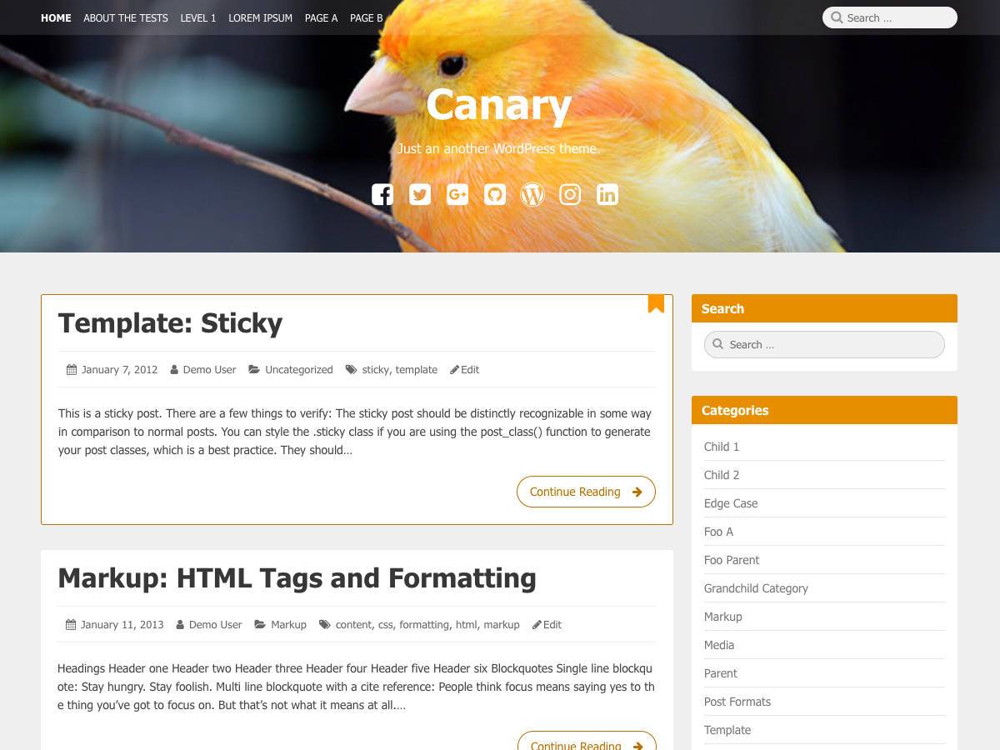

# Canary

Canary is clean, blog-focused, and designed for clarity, with simple, straightforward typography that's readable on a wide variety of screen sizes, and suitable for multiple languages.This theme, like WordPress, is licensed under the GPL. Use it to make something cool, have fun, and share what you've learned with others.

## Features

1. Coded in HTML5 and CSS3
2. Simple and Responsive layout.
3. Custom Header
4. Custom Background
5. Custom Logo
6. Custom Menu Locations.
7. 2 Columns.
8. Post Formats
9. Widget Ready.
10. Header Background Video
11. Fast loading structure
12. Well-commented CSS and theme PHP files for flexible customization.
13. Multi-browser compatibility. Tested under modern w3c compliant browsers. Firefox , Opera ,Safari and Chrome.
14. Free of cost

## Download
You can download latest version from [WordPress.org](https://wordpress.org/themes/canary/).

## Troubleshooting
If you have any problems running WordStar, [Support Forum](https://linesh.com/forums/forum/themes/canary/).

## License
Canary is licensed under [GNU General Public License v2 (or later)](./LICENSE.md).
